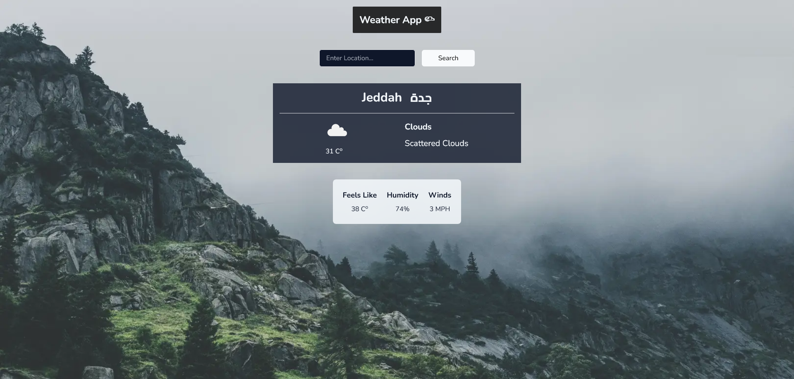

# Weather App ☁️

This is a simple Weather Application created using the Weather API [OpenWeather](https://openweathermap.org/api) to get the today's weather of the chosen city.

## Table of contents

- Overview
  - Features
  - Screenshot
  - Links
  - Setup
- My process
  - Built with
- Author

## Overview

### Features

Users should be able to:

- View the optimal layout for the site depending on their device's screen size.
- Auto detection of the user location by using W3C Geolocation API and get the current day weather information.

### Screenshot



### Links

- Live Site URL: [Here](https://weather-app-psi-lime.vercel.app/)
- GitHub URL: [Here](https://github.com/MohanadOO/weather-app) 

### Setup

Using yarn 👇

```
$ yarn
$ yarn dev
```

Using NPM👇

```
$ npm install
$ npm run dev
```

## My process

### Built with

- [React](https://reactjs.org/) - JS library
- [Tailwind CSS](https://tailwindcss.com/) - CSS framework
- [Framer Motion](https://www.framer.com/motion/) - Animation Library for React

## Author

- Website - [Mohanad Portfolio](https://mohanad.in)
- Twitter - [@MohanadOO_](https://twitter.com/MohanadOO_)
